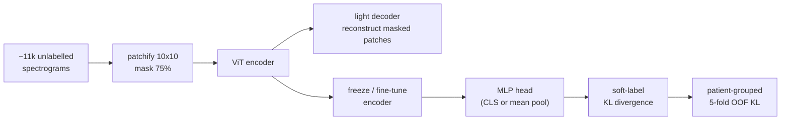

# eeg_mae — Spectrogram Masked Autoencoder for Harmful Brain Activity

Self-supervised representation learning on EEG spectrograms for the
[HMS – Harmful Brain Activity Classification](https://www.kaggle.com/competitions/hms-harmful-brain-activity-classification)
task. A ViT Masked Autoencoder is pretrained on unlabelled spectrograms, then a small
classifier head is trained on **soft labels** with the competition's **KL-divergence**
objective. The package is a clean, reproducible, resumable re-implementation of the
project's exploratory `03b` / `03b2` notebooks.

> **Author:** Niels Pacheco Barrios — Carrera de Especialización en Inteligencia Artificial (FIUBA).
> Data is **not** included in this repository (see *Data*).

## Pipeline



## Why this design

- **Soft labels + KL** everywhere in the supervised stage — the training objective matches
  the evaluation metric (experiments 1 & 2).
- **Resumable training**: every epoch is checkpointed (weights + optimizer + scheduler + RNG);
  a killed run resumes from the next epoch. Verified bit-exact on CPU
  (`tests/test_resume_equivalence.py`). Built for long, interruptible Mac/MPS runs.
- **Config-driven experiments**: each thesis study is a YAML file under `configs/` consumed by
  one CLI, and results are cached idempotently so nothing is recomputed.

## Install

```bash
# Uses the project's external venv (kept outside iCloud-synced paths).
uv pip install --python ~/venvs/hms/bin/python -e ".[dev,viz,cnn]"
```

## Data

The raw competition data and derived arrays are git-ignored and read **in place**. By default
the package looks for them next to this repo; override with environment variables:

```bash
export EEG_MAE_DATA_ROOT=/path/to/hms-harmful-brain-activity-classification
export EEG_MAE_PROCESSED=/path/to/data/processed
python -c "from eeg_mae import paths; print(paths.describe())"
```

## Quickstart

```bash
# 1. Self-supervised MAE pretraining (resumable; snapshots encoder @ 30/60/90 epochs)
eeg-mae-pretrain --epochs 90 --enc-dim 192 --enc-heads 3

# 2. Run a thesis experiment from its config (resumable, cached OOF)
eeg-mae-experiment configs/exp2_head_depth.yaml

# 3. Regenerate all report figures from results/
eeg-mae-figures
```

## Experiments (thesis)

| # | Study | Config |
|---|-------|--------|
| 1 | Soft-label + KL supervised objective | baked into all supervised configs |
| 2 | MLP head depth/width vs `LogisticRegression` | `configs/exp2_head_depth.yaml` |
| 3 | MAE pretraining epochs {30, 60, 90} | `configs/exp3_epoch_sweep.yaml` |
| 4 | Encoder width `enc_dim` sweep | `configs/exp4_enc_dim.yaml` |
| 5 | Frozen vs fine-tune, discriminative LR | `configs/exp5_finetune.yaml` |
| 6 | CLS token vs mean pooling | `configs/exp6_pooling.yaml` |
| 7 | Latent map (t-SNE / UMAP) | `configs/exp7_latent.yaml` |

Each logs both the **MAE reconstruction loss** and the **classification KL**. The champion of
(3 × 4) gates experiments 5–7.

## Development

```bash
~/venvs/hms/bin/python -m pytest      # unit tests (fast; no data needed)
~/venvs/hms/bin/python -m ruff check src tests
```

See `docs/adr/` for architecture decisions and `docs/brainbert_phase4_plan.md` for the parked
BrainBERT roadmap.
